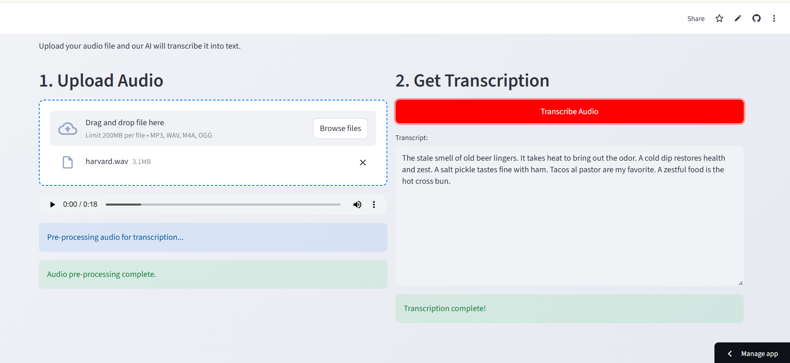

# 🎙️ AI Audio Transcriber

**➡️ Live Demo:** [**Click here to try the app!**](https://sarthakaiaudio.streamlit.app/)

A web application built with Streamlit that transcribes audio files to text using OpenAI's Whisper model. This app is multilingual, fast, and provides a clean user interface for uploading and viewing transcriptions.



---

## ✨ Features

* **Multilingual Transcription:** Powered by `openai/whisper-base`, this app can accurately transcribe audio from numerous languages.
* **Support for Multiple Formats:** Upload your audio in `MP3`, `WAV`, `M4A`, or `OGG` format.
* **Interactive UI:** A clean, two-column layout allows for easy file uploading and immediate viewing of the transcript.
* **Audio Pre-processing:** Automatically re-samples uploaded audio to the 16kHz format required by the Whisper model.
* **Custom Styling:** A custom `style.css` file gives the app a professional look beyond the Streamlit defaults.

---

## 🛠️ Tech Stack

* **Framework:** [Streamlit](https://streamlit.io/)
* **AI Model:** [OpenAI Whisper](https://github.com/openai/whisper) (via `transformers` library)
* **Audio Processing:** [Librosa](https://librosa.org/)
* **Deployment:** [Streamlit Community Cloud](https://share.streamlit.io/)

---

## 🚀 How to Run Locally

To run this project on your local machine, follow these steps:

1.  **Clone the repository:**
    ```bash
    git clone [https://github.com/Squaddyy/AI-Audio-Transcriber.git](https://github.com/Squaddyy/AI-Audio-Transcriber.git)
    cd AI-Audio-Transcriber
    ```

2.  **Create and activate a virtual environment:**
    ```bash
    # For Windows
    py -m venv venv
    source venv/Scripts/activate
    
    # For macOS/Linux
    python3 -m venv venv
    source venv/bin/activate
    ```

3.  **Install the required packages:**
    ```bash
    pip install -r requirements.txt
    ```

4.  **Run the Streamlit app:**
    ```bash
    streamlit run app.py
    ```
    The app will open in your default web browser.

---

## Acknowledgements

* This project leverages the powerful `transformers` library by [Hugging Face](https://huggingface.co/).
* The AI model is the `whisper-base` model by [OpenAI](https://openai.com/).
